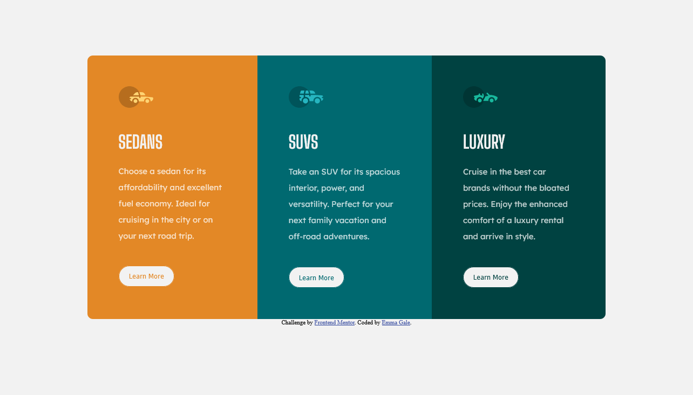

# Frontend Mentor - 3-column preview card component solution

This is a solution to the [3-column preview card component challenge on Frontend Mentor](https://www.frontendmentor.io/challenges/3column-preview-card-component-pH92eAR2-). Frontend Mentor challenges help you improve your coding skills by building realistic projects.

## Table of contents

- [Overview](#overview)
  - [The challenge](#the-challenge)
  - [Screenshot](#screenshot)
  - [Built with](#built-with)
  - [What I learned](#what-i-learned)
  - [Continued development](#continued-development)
  - [Useful resources](#useful-resources)
- [Author](#author)
- [Acknowledgments](#acknowledgments)

## Overview

### The challenge

Users should be able to:

- View the optimal layout depending on their device's screen size
- See hover states for interactive elements

### Screenshot

### Links

- Live Site URL: [Add live site URL here](https://github.com/emjogale/3-column-preview-card)

### Built with

- Semantic HTML5 markup
- CSS custom properties
- Flexbox
- Mobile-first workflow

### What I learned

Firstly I realised that using a <link> tag for Google fonts was the way to go - as the @import wasn't working correctly for me. Secondly that the line height is really important for giving nice spacing on the text.
I also learnt that the hover transition would be much nicer if I had a border already on the button - and had it the same colour as the background - so it wouldn't show until the hover transition happended. Otherwise the added height would cause the page to move in an annoying way.
Using <object> tags for the svg's seemed to work well - whether this is preferrable to an  or not yet I don't know.

### Continued development

I'm still not 100% on the container and positioning rules. Sometimes it seems I'm not sure whether a container is necessary or not - but I will hopefully get the hang of this.

### Useful resources

- [Example resource 1](https://developer.mozilla.org/en-US/docs/Web/CSS/line-height) - This helped me for the line height.
- [Example resource 2](https://www.freecodecamp.org/news/use-svg-images-in-css-html/) - This is really interesting article about the various ways you can use svg images.

## Author

- Frontend Mentor - [@emjogale](https://www.frontendmentor.io/profile/emjogale)
- Twitter - [@emmagale2635](https://www.twitter.com/emmagale2635)
